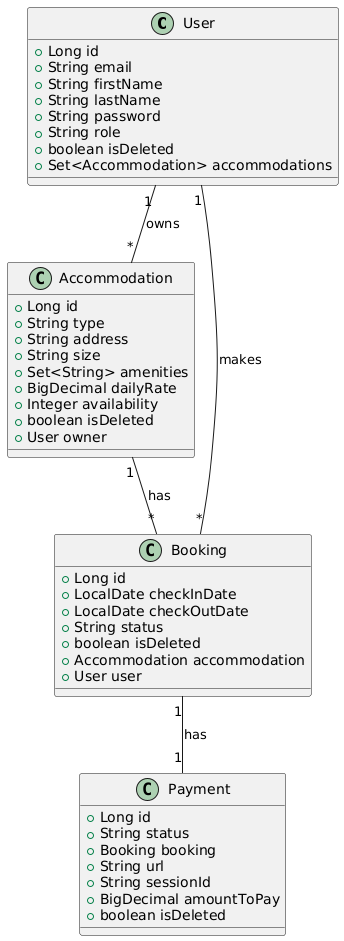

## Accommodation booking API

### ✏️ Intro
Welcome to Accommodation booking API - the second big project I've done using Spring Boot to master my existing skills and get the new ones along the way. 
It's an API that allows users to make bookings of existing properties offered by Administrators or even other users! It has secure authentication/authorization, notification system using Telegram API and integrated payment system, a.k.a. Stripe.
Let me guide you through the details.
---
### 📡 Tech stack
- Java 17
- Spring Boot 3.5.0
- Spring Data JPA 3.5.0
- Spring Security 3.5.0
- PostgreSQL 42.7.5
- Docker 3.4.2
- JUnit 4.13.2
- Swagger 5.20.1
- Mapstruct 1.6.3
- Liquibase 4.31.1
- Telegram API
- Stripe API
---
### 🧨 Functionality
1. Authentication & Authorization
    - Registration (`POST /auth/register`)
    - Login (`POST /auth/login`) with JWT return
    - Role-based access (Admin, Manager, User)

2. User Management
    - Get my profile (`GET /users/me`)
    - Update my profile (`PATCH /users/me`) (Manager/User)
    - Update user role (`PUT /users/{id}/role`) (e.g. User -> Manager, or the other way around)

3. Accommodation Management
    - Create accommodation (`POST /accommodations`) (Admin/Manager)
    - Update accommodation (`PATCH /accommodations/{id}`) (Admin/Manager)
    - Delete accommodation (`DELETE /accommodations/{id}`) (Admin/Manager)
    - View all accommodations (`GET /accommodations`) (Public)
    - View accommodation by ID (`GET /accommodations/{id}`) (Public)

4. Booking System
    - Create booking (`POST /bookings`) (User/Manager)
    - View my bookings (`GET /bookings/my`) (User/Manager)
    - Update booking (`PATCH /bookings/{id}`) (User/Manager/Admin)
    - View all bookings (`GET /bookings`) (Admin)
    - Delete booking (`DELETE /bookings/{id}`) (Admin)
    - View booking details (`GET /bookings/{id}`) (All roles)

5. Payment Processing
    - Initiate payment (`POST /payments`) (User/Manager)
    - View payment history (`GET /payments`) (All roles)

- Telegram notification system on accommodation creation/update, booking creation/status change and successful payments.
- All the notification are being sent to a dedicated custom Telegram chat automatically using bot functionality.
- Scheduled daily job that identifies expired bookings, releases them and notifies you about it in the same Telegram chat.
- Stripe integration with success and cancellation handling. Notification on successful payments.  
- Unit tests, of course!
---
### 🔬 UML Diagram

---
### 🔧 How to run and build the project locally
- Install:
    - Java 17
    - Maven
    - MySQL
    - Docker
- Clone the repository:
```
https://github.com/olieniev/booking-app.git
cd booking-app
```
- Create an env file (a template is provided, see "env.template" file)
- Add your Telegram API token (see BotFather in TG documentation) and chat id to application.properties file.
- Add Stripe API token, refer to Stripe documentation.
- Run the following commands:
```
mvn clean install
docker-compose build
docker compose up
```
- Launch Swagger locally via the
```
http://localhost:8080/api/swagger-ui/index.html 
```
---
### 🧪 [Postman collection for testing](https://postman.co/workspace/My-Workspace~b74e25ab-645c-4949-88aa-7fad3466af15/collection/11850098-5677ca67-c85b-4c5b-85ba-250961c0b68c?action=share&creator=11850098)
- Locally: just run the app as explained previously and send requests as they are using JWT token when needed ('jwt_token' variable is ready to paste and use for your convenience).
---
### ⚠️ Challenges faced
- First real 3rd party API integration - Telegram ✅
- First real payment integration using Stripe ✅
- Scheduled job logic implementation to identify and release expired bookings ✅
- One more thing: implemented unit tests indeed helped me to identify bugs and fix inefficiencies, which I am really happy about.